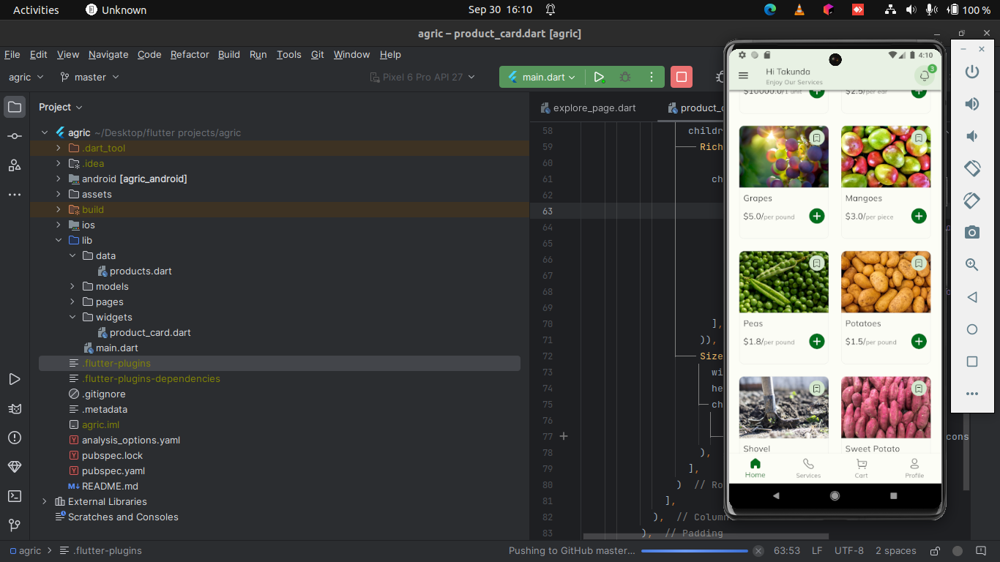
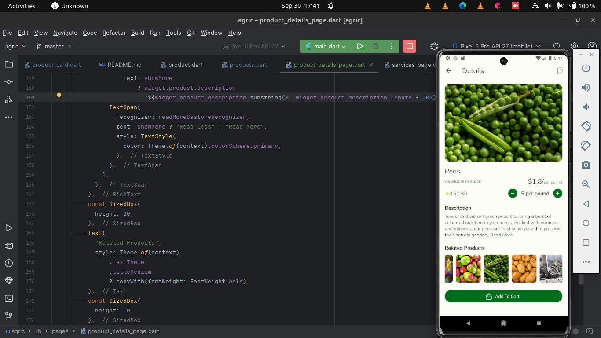

# Agriculture Ecommerce Mobile App UI

Welcome to our Agriculture Ecommerce mobile application UI project! This project aims to provide a seamless and intuitive user interface for buying and selling agricultural products. The app allows farmers and buyers to connect, explore products, and make transactions easily.

## Features

- **User Authentication:** Secure user login and registration system.
- **Product Listings:** Browse a wide range of agricultural products with detailed descriptions.
- **Search and Filters:** Easily find products using search and filter options.
- **Cart and Checkout:** Add products to the cart and proceed to a smooth checkout process.
- **Product Details:** View detailed information about each product, including images, prices, and descriptions.
- **Order History:** Keep track of past orders and transactions.
- **User Profiles:** Personalized profiles for users and sellers.
- **Notifications:** Receive updates on orders, new products, and promotions.

## UI Screenshots

*Home/ Explore Page*

*Details Page*
Happy farming and happy coding! 🌾🚜
